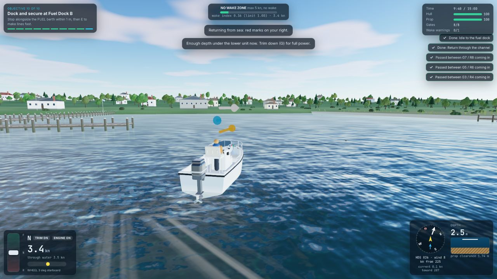
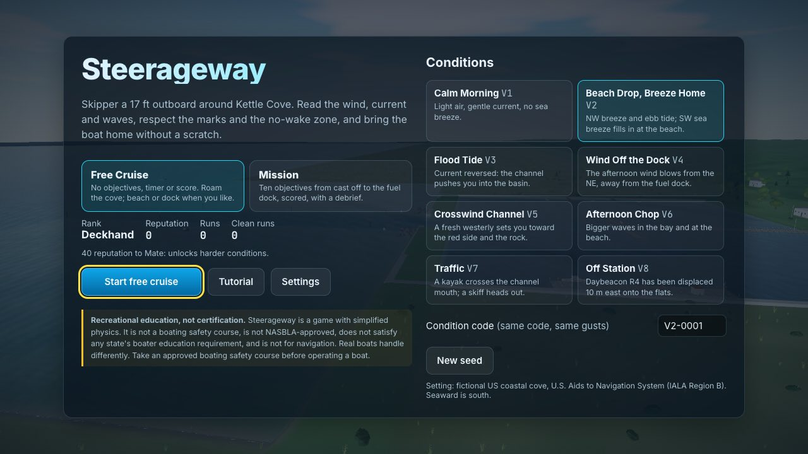
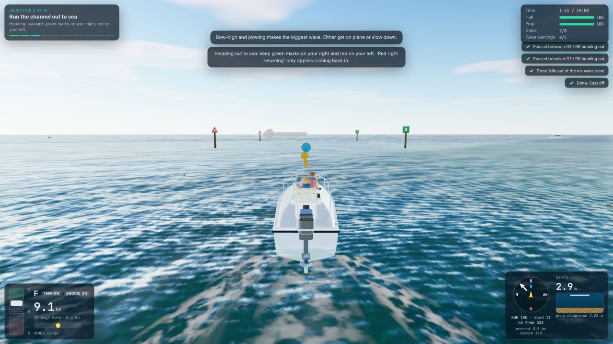
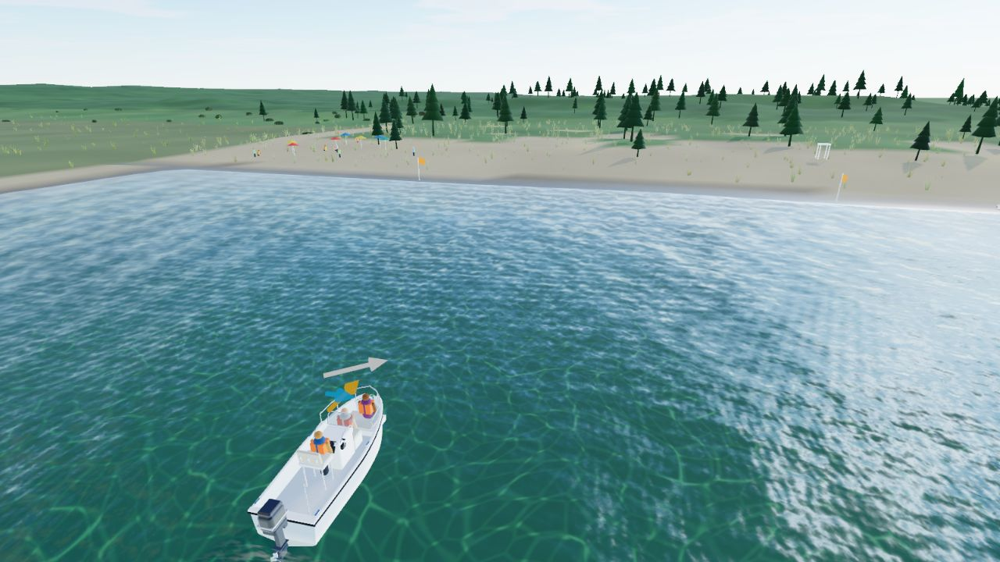
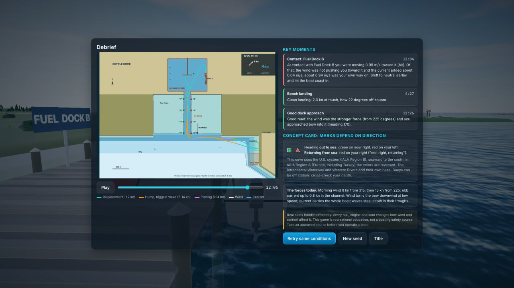
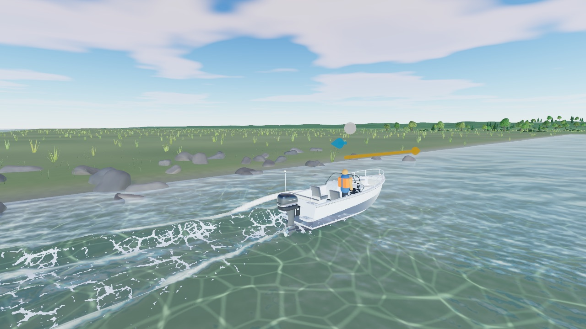
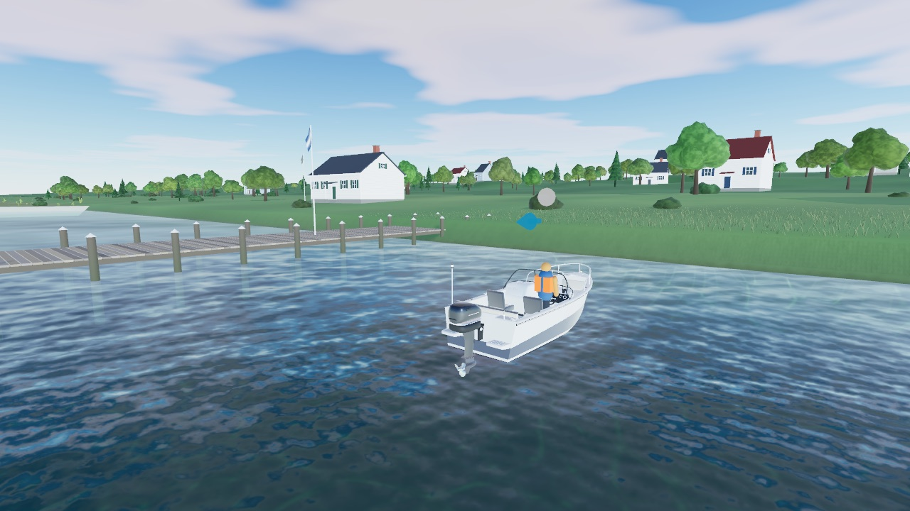
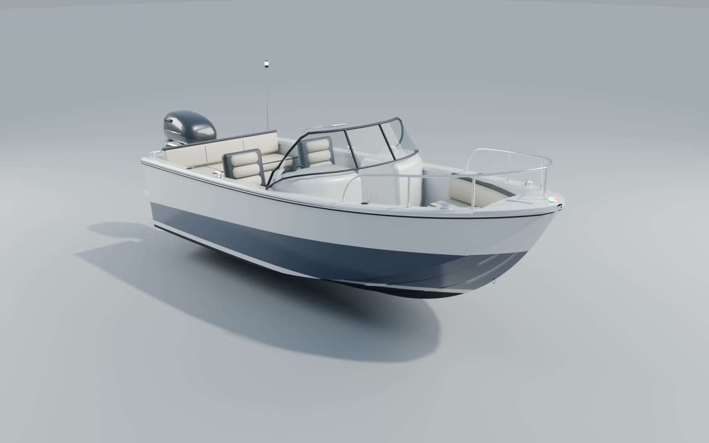
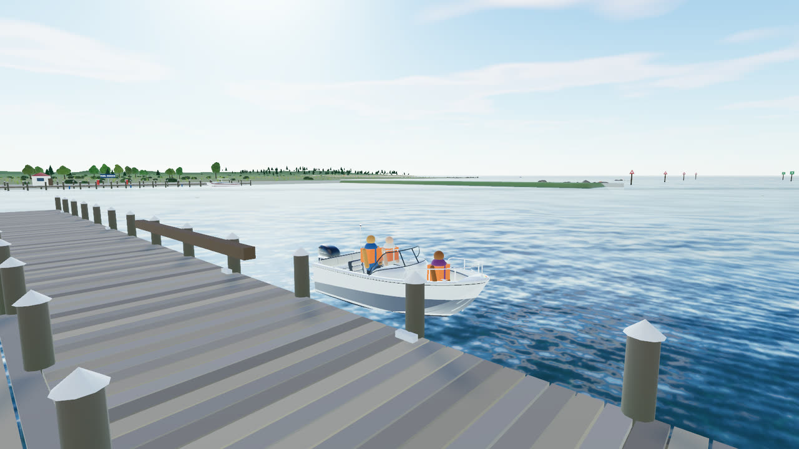

# Steerageway: Beach Drop, Breeze Home

[](https://github.com/cankilic-gh/steerageway/actions/workflows/ci.yml) [](LICENSE)

**Play:** https://steerageway.thegridbase.com (desktop browser with WebGL 2, keyboard or gamepad)



A browser-playable 3D small-boat handling game with a real seamanship core. You skipper a 17 ft (5.2 m) open-bow outboard runabout around fictional Kettle Cove: cast off, idle out of the no-wake zone, run a marked channel out to sea, cross the bay, land two guests on a sandy beach, then bring the boat back through the channel and dock at the fuel dock after the sea breeze fills in.

Or pick **Free Cruise** on the title screen: the same boat, water and weather with no objectives, timer or score. Roam, beach or dock when you like.

| | |
|---|---|
|  |  |
|  |  |

|  |  |
|---|---|

More in [`docs/screenshots/`](docs/screenshots/), including the [water-optics before/current/final comparison](docs/screenshots/water-optics-comparison.jpg).

The design comes from the research documents in this repository: `CONCEPT_REPORT.md`, `FIRST_MISSION.md`, `SOURCES.md` and `TECH_RESEARCH_ADDENDUM.md`. Implementation notes, RED/GREEN test evidence and verification results are in `DEVELOPMENT_LOG.md`.

> **Recreational education, not certification.** Steerageway is a game with simplified physics. It is not a boating safety course, is not NASBLA-approved, does not satisfy any state's boater education requirement, and is not for navigation. The cove and its chart are fictional. Real boats handle differently: every hull, engine and load changes how wind and current affect it. Take an approved boating safety course before you operate a boat.

## Run it

Requirements: a desktop browser with WebGL 2 (current Chrome, Edge, Safari or Firefox) and Node.js **22.13+ (LTS), 24.x (LTS), or 26+**, matching `engines` in `package.json` and `.nvmrc` (22). That range is the intersection of what the toolchain supports: Vitest 5 requires `^22.12 || ^24 || >=26`, and ESLint 10 requires `^22.13` on the 22 line. Odd-numbered releases (23, 25) and Node 20 are not supported; `npm ci` prints `EBADENGINE` warnings on them. Verified with Node 22.23.1.

```bash
npm ci                 # install exact dependencies from package-lock.json
npm run dev            # dev server at http://localhost:5173
```

Production build and local static server:

```bash
npm run build          # strict typecheck + Vite production build into dist/
npm run preview        # serve dist/ at http://localhost:4173
```

Everything runs locally. No network access is needed at runtime:
- Fonts are bundled.
- Textures, world models and audio are generated procedurally.
- The player's hero boat is a same-origin GLB (`public/assets/boats/v20-inspired-hero.glb`) generated from code in Blender (see [Hero boat asset](#hero-boat-asset-blender)).

## Test and verify

```bash
npm run lint           # ESLint (typescript-eslint strict)
npm run typecheck      # tsc --noEmit, strict mode
npm test               # Vitest unit tests (simulation, rules, scoring, autopilot)
npm run e2e            # Playwright: fresh build served on port 4317 (never reuses a running server), Google Chrome + WebKit
npm run verify         # all of the above in order
```

Before the first `npm run e2e` on a new machine, install the browser engines once: `npx playwright install webkit chromium`. The Chrome project uses the installed Google Chrome (`channel: 'chrome'`).

**Continuous integration** (`.github/workflows/ci.yml`, Node from `.nvmrc`, currently 22) runs on pushes to `main`, on pull requests and on demand:

1. `quality`: `npm ci`, lint, typecheck, unit tests and the production build.
2. `browser-smoke`: one test, tagged `@ci-smoke` (`tests/e2e/ci-smoke.spec.ts`), in Playwright's bundled Chromium with SwiftShader software WebGL 2 (`npm run e2e:ci`), because hosted runners have neither Google Chrome nor a GPU. It checks that the production build boots with a live WebGL 2 canvas and the right title, starts Free Cruise, and shows the quiet cruise HUD with no mission structure (no briefing, objective panel or timer). It uses one page load and no long simulation.
   - CI does **not** run the full browser suite. On CPU-rendered WebGL the suite's repeated page loads and simulation steps exceed per-test time budgets and can lose browser contexts, so the full suite (including the `@ci-smoke` test) runs locally on Chrome and WebKit with `npm run e2e` or `npm run verify`.

Optional QA helpers write their output to `artifacts/`, which is not committed. They require `npm run preview` running on port 4173:

```bash
node scripts/qa-perf.mjs normal     # headed Chrome frame-rate report per scene (also: low)
node scripts/qa-firefox.mjs         # Firefox WebGL 2 compatibility smoke
node scripts/qa-assists.mjs         # screenshot of the Predictor and Depth emphasis assists
```

Visual comparison (dock, channel, open water, beach, sunny and overcast water from fixed poses; pass the server's port):

```bash
node scripts/qa-scenes.mjs artifacts/qa/final 4173              # writes final-dock.png ... final-overcast.png
QA_ENGINE=webkit node scripts/qa-scenes.mjs artifacts/qa/wk 4173 # same shots in WebKit
node scripts/qa-compare.mjs artifacts/qa/compare-water-optics.png before,current,final dock,channel,openwater,beach,sunny,overcast
node scripts/qa-pixels.mjs artifacts/qa/final-channel.png 0,380,1600,520   # mean color and clipped-white share
node scripts/qa-shimmer.mjs 4173 chrome                          # frame-to-frame change at the horizon and mid water
node scripts/qa-perf.mjs high 4173                               # perf report for a preset on a given port
```

Developer and test mode: open `http://localhost:5173/?test=1` to expose `window.__steerageway`. It offers:
- `start(variant, seed, 'mission' | 'cruise')`
- `setSky('sunny' | 'overcast' | null)`
- autopilot, fast-forward, teleport and perf
- `boat()`: which boat visual is showing, its load status, and the wheel, lever, outboard and prop rotations

Add `&autopilot=1` to watch the scripted skipper drive the mission, and `&speed=4` to speed it up. Add `&boat=procedural` to keep the procedural boat for before/after comparisons. Normal play never loads this API.

## Hero boat asset (Blender)

| | |
|---|---|
|  |  |

The player boat is an original, logo-free, **V20-inspired** open-bow outboard. It is not an official manufacturer model; the design brief and every dimension are in `BLENDER_BAYLINER_V20_PROMPT.md`. It keeps the simulation's 5.2 m × 2.1 m envelope, the waterline, and the outboard pivot of the procedural boat.

- **Source of truth:** `tools/blender/generate_v20_hero.py`, a deterministic Blender 5.2 LTS script with no imported meshes or images. It writes:
  - the editable `assets-src/blender/v20-inspired-hero.blend`
  - the runtime `public/assets/boats/v20-inspired-hero.glb` (29,261 triangles, 15 PBR materials, 1.08 MB, no Draco, Meshopt or KTX2, no external URIs)
- **Regenerate:**

  ```bash
  npm run asset:boat        # .blend + GLB, then prints the GLB stats (scripts/glb-inspect.mjs)
  npm run asset:boat:qa     # also renders the Blender QA views into artifacts/qa/v20-hero/
  BLENDER=/path/to/blender npm run asset:boat   # non-default Blender location
  ```

- **Runtime** (`src/render/heroBoat.ts`):
  1. `SceneView` still builds the procedural boat synchronously, so construction, input and the first frame are unchanged.
  2. On Normal and High it then loads the GLB in the background. `bindHeroBoat` validates the node contract (`Hull`, `EnginePivot`, `Prop`, `Wheel`, `Throttle`), the envelope and the pivot, and merges static meshes per material.
  3. `applyBoatVisual` swaps it in. The per-frame wheel, lever, outboard and prop writes now drive the GLB nodes, and the existing crew figures move to the seat anchors authored in the asset.
- **Fallback:** Low quality, a failed or blocked request, or a contract failure keeps the procedural boat. A failure logs one console warning.
- **Tests:**
  - `tests/unit/heroBoat.test.ts`: contract, swap and fallback.
  - `tests/unit/heroBoatAsset.test.ts`: GLB inspection covering nodes, axes, bounds, budgets, no external URIs and no brand strings.
  - `tests/e2e/hero-boat.spec.ts`: Chrome and WebKit. The hero loads, its parts react, a blocked asset falls back, and Low never requests the asset.
- **Visual QA** (preview running on the given port) writes procedural, hero and blocked-fallback shots of the same poses, with draw calls and triangles:

  ```bash
  node scripts/qa-hero.mjs artifacts/qa/v20-hero/game 4173
  QA_ENGINE=webkit node scripts/qa-hero.mjs artifacts/qa/v20-hero/game 4173
  QA_QUERY='&boat=procedural' node scripts/qa-perf.mjs normal 4173   # procedural-boat perf baseline
  ```

- **Licensing:** see `ASSET_LICENSES.md`.

## Controls

| Action | Keyboard (remappable) | Gamepad |
|---|---|---|
| Throttle lever forward / back (holds position; past neutral is reverse) | W / S or Up / Down | Right stick Y (RT / LT in arcade mode) |
| Snap to neutral | Space | B |
| Wheel to port / starboard (holds its angle) | A / D or Left / Right | Left stick X |
| Center the wheel | C | Left stick click |
| Trim engine up / down | T / G | D-pad up / down |
| Action: cast off, engine off on the beach, push off, start engine, make lines fast (Free Cruise also: tie up alongside a dock, call a tow when stranded) | E or Enter | A |
| Engine start / stop | K | X |
| Cycle camera (chase, helm, top-down; docking view is automatic) | V | Y |
| Chart overlay | Tab | View / Back |
| Pause | Esc or P | Start |
| Look around / zoom | Mouse drag / scroll wheel | |

## What is implemented

**Free Cruise** (the default on the title screen; Mission is one click away)
- No objectives, countdown, score, reputation change or debrief, and no forced route or beach/dock sequence. The run ends only when you quit.
- Pick any of the 8 conditions and a seed. Locked conditions are open in cruise. Gusts continue for 3 hours. The first 20 minutes match the mission gusts for the same code, and the sea breeze still arrives on its timeline.
- Physical hazards stay:
  - Contact damage, grounding and prop strikes.
  - A breached hull, hard grounding or destroyed prop strands the boat. Press E (or use the pause menu) to be towed back to Dock A and repaired.
- Rule breaches never end the run. The no-wake zone, swim area and chart edge give optional training hints: off by default, on in Settings ("Training hints in Free Cruise"). A saved preference is kept.
- Dock voluntarily: stop alongside the fuel dock or Dock A (within 1 m, roughly parallel, stopped for 3 s) and press E to tie up; press E again to cast off. Beach anywhere on sand; E pushes off.
- A quiet HUD: the instruments, plus one status line (stranded, tied up, alongside, on the sand, engine off). The objective panel, score and checklist are hidden.
- Pause menu: resume, tow back to Dock A, restart cruise (same conditions), settings, tutorial, quit to title.

**Mission and game structure**
- Title screen with rank, reputation, runs and clean runs. Condition picker for 8 variants (Calm Morning, Beach Drop, Flood Tide, Wind Off the Dock, Crosswind Channel, Afternoon Chop, Traffic, Off Station). Variants unlock by rank; locked ones are playable as practice.
- Shareable condition codes (for example `V2-0001`): the same code gives the same seeded gust timeline.
- Job briefing with wind, current, waves, forecast and the 10 objectives.
- Playable onboarding while tied up: a checklist that ticks off lever, neutral, wheel and cast off.
- 10 data-driven objectives: cast off, idle out of the no-wake zone, run the channel out, cross the bay, land on the beach, drop off the guests, push off and depart, return through the channel, idle to the fuel dock, dock and secure.
- 7 failure states: hull breached, hard aground, citation, propeller destroyed, swim area entered, outside the rental area for more than 20 s, and the 15:00 time cap.
- A 1000-point score across 7 categories (navigation, rules, docking, beaching, care, reading, open-water leg), stars at 650 and 850, reputation, a Clean Run badge, a logbook and best scores. All are saved locally in `localStorage`.
- Result screen and debrief:
  - Top-down chart replay with a scrubber. The track is colored by hull regime, with wind and current arrows at the scrubbed time.
  - Up to three key moments with rule-generated causal explanations, for example how much of a dock contact was wind, current or the boat's own way.
  - A concept card on direction-dependent marks.
  - Retry with the same conditions or a new seed.
- Pause menu (resume, restart with the same conditions, settings, tutorial, quit). The game auto-pauses when the tab is hidden.

**Simulation** (deterministic, fixed 60 Hz, independent of rendering)
- 3-DOF (surge, sway, yaw) outboard boat model.
  - Throttle and gear: lever with a neutral band, 0.4 s shift delay through neutral, engine lag, reverse at 50%.
  - Steering: thrust vectoring, a lower-unit rudder effect, prop walk in reverse.
  - Hull: speed-dependent hull tracking and distributed lateral resistance.
- **Wind** acts on above-water area. The bow blows downwind at low speed. Seeded gust bands are visible on the water before they arrive.
- **Current** moves the water: all hydrodynamic forces use velocity relative to the water, and current shear turns the hull.
- **Waves** use a shared sum-of-sines function. The same function displaces the rendered water, moves the boat's heave, pitch and roll, and reduces keel clearance in the troughs. Slams happen at planing speed.
- Depth field and grounding classified as touch, strike or hard aground (sand or rock), with lower-unit strikes when trimmed down. Beaching uses sand friction and a crew push-off. Docking contact is classified as kiss, bump, hit or crash.
- Rules and seamanship tracking:
  - No-wake enforcement uses the wake index, which peaks at hull speed, plus a 5 kn limit, then a warning and a citation.
  - Channel gates are scored by direction (US IALA Region B, seaward to the south).
  - Safe-speed events near vessels and swimmers; wake hits on moored boats.
  - Drift checks, and whether the dock approach was bow into the stronger force.
- The sea breeze phase is triggered by the drop-off, blending wind, gusts and waves over 60 s.

**Rendering and presentation** (Three.js r186 `WebGLRenderer`, WebGL 2)
- **Sky and lighting:**
  - Physical sky with clouds and environment lighting.
  - Sky presets change sky, light, haze and water together: a clear morning, and an overcast sky for Afternoon Chop.
  - The scene is composed in linear HDR and tone mapped once (ACES).
  - Sun-aligned shadows and exponential aerial haze.
- **Water optics** (model in `src/render/waterOptics.ts`, unit-tested):
  - Physics-synchronized geometric waves, plus two scales of moving micro-ripples tied to the local wind. The ripples fade by pixel footprint, and what they lose becomes roughness, so there is no moire and distant water is not a mirror.
  - Schlick Fresnel (IOR 1.333) splits reflection and transmission: you look into the water near the boat and see the sky at grazing angles.
  - Narrow, broken sun glitter replaces a broad glare lobe.
  - Temperate green-teal color: absorption along the refracted light path lets you see a sandy bottom in shallow water, and it fades out by about 6 m.
  - Moving caustics on the shallow seabed. Submerged pilings and hulls fade with depth.
  - A thin, broken swash line and a wet sand band at the shore. Whitecaps above about 10 kn, current filaments, gust patches and depth-emphasis contours.
- **Terrain and world:**
  - Terrain and seabed come from the same depth grid as the physics.
  - Shader detail: noise-varied grass and sand, and a darker wet-sand band at the waterline.
  - Marsh, dunes and hills; gabled houses with windows; instanced lobed trees, pines, shrubs, grass and dune grass; about 420 rocks on the jetties and shores.
- **Harbor:**
  - Weathered plank docks with tide-stained, capped pilings, cleats and fenders, and a fuel dock with shed and pumps.
  - Numbered red-triangle and green-square daybeacons with tide bands, readable from both directions.
  - NO WAKE, ROCK and swim-area buoys.
  - Moored craft that rock when you wake them, swimmers and beachgoers, and flags that stream downwind.
- **Boats:**
  - A procedural 17 ft center-console: sheer line, hull strake, non-skid deck, and a console with windscreen.
  - A cowled outboard that trims and steers, with a spinning prop.
  - The wheel and throttle lever move with your inputs. Nav lights, and crew in life jackets. Guests appear on the beach after the drop-off.
- **Effects:** Kelvin wake arms sized by the wake index, bow spray, and floating debris that drifts with the current.
- **Cameras:** a horizon-stable chase camera, an automatic elevated docking and beaching view, helm and top-down views, drag-to-look, zoom, FOV slider and optional camera shake.
- **HUD:**
  - Throttle lever with detents and gear, wheel angle, speed over ground and through the water.
  - Depth sounder with prop clearance and a shallow warning in text and icon.
  - Compass with wind, current and gust ring.
  - No-wake meter, docking and beaching guides, prompts and toasts, and the chart overlay.
- **Assists:** a Predictor ribbon with a ghost hull 5 s ahead from the same model (orange when it predicts grounding), force arrows, docking guides, depth emphasis (contours and hatching, not color alone), game speed 50/75/100%, arcade throttle and wheel auto-center.
- **Accessibility:** key remapping, text scale, high-contrast panels, focus-visible styling, `aria-live` prompts and reduced-motion support. Marks are distinguished by shape and number, not only color.
- **Audio:** procedural Web Audio for the engine note by rpm, water, wind, contacts, prop strikes, the harbor patrol horn and radio.
- **Quality and fallback:** Low, Normal and High quality presets plus dynamic resolution. A WebGL 2 check shows a fallback page, and there is a context-loss message.

## Known limitations

- **Real Safari app not automated.** Safari's Remote Automation was not available in the development environment. Safari compatibility is verified with Playwright WebKit (Safari's engine), which passes the full browser suite. Chrome passes the same suite and Firefox passes a compatibility smoke test.
- **Wind Off the Dock (V4)** is completable by a careful human (stop within 1 m of the face, hold 3 s, secure 3 s) but not by the scripted autopilot. It is excluded from the autopilot regression test on purpose rather than making the rule easier.
- **The autopilot is a test harness, not a model skipper.** Its V2 run succeeds with 2 stars but bumps the fuel dock at about 1 m/s during its entry turn.
- **Handling tuning:** the idle full-lock turning diameter is about 21 m (about 4 boat lengths), wider than the concept report's rough target of 2 boat lengths.
- **Visual wave fade:** wave displacement and normals fade out beyond about 90 to 600 m from the camera to avoid aliasing. The physics uses full wave amplitude everywhere; near the boat, what you see and what the boat feels are identical.
- **Art style:** all art is procedural. The realism pass adds physically based water, terrain detail and more detailed props, but the look is still stylized, not photoreal.
  - The only authored model is the Blender hero boat, which is original and material-only (no texture atlas, KTX2 or Meshopt yet). The beach, trees, dock and people are still procedural. They are planned in `.hermes/plans/2026-09-29_2337-v20-inspired-hero-boat.md` (people are out of scope).
  - On the Normal preset the scene is about 0.9 to 1.1 M triangles and 78 to 176 draw calls. It holds 120 fps on an Apple M5; see `DEVELOPMENT_LOG.md`.
- **Water optics:**
  - Mid-distance water is busier than before (moving ripples and glitter). The High preset (2x pixel ratio) runs about 7% slower than before the water-optics pass; Normal and Low still hold the 120 fps display cap on an Apple M5.
  - The overcast sky reads as thin high cloud: the three.js `Sky` cloud model cannot make a solid grey deck.
  - A faint 1-pixel horizontal line can appear across the water in the dock view. It predates the water-optics pass.
  - See `WATER_REFERENCE.md` and `DEVELOPMENT_LOG.md`.
- **Free Cruise:**
  - There is no free-roam logbook or score.
  - Tie-up is offered only at the fuel dock and Dock A faces, not at moored boats or the jetties.
- **Quality presets:** changing quality applies resolution and shadows immediately. Terrain and grass density follow the preset on the next page load.
- **Not in v1:** the stand-alone drills and the Region A (Europe, Turkey) presentation mode from the concept roadmap. There is no touch control scheme; on phones the menus are responsive but the game asks for a desktop.
- **Gamepad:** code is included and runs error-free with no gamepad connected, but it has not been tested with a physical controller.
- **Replays:** debrief replays are deterministic within one browser engine. Cross-engine bit-identical replays were not verified.

## Deploy

The production site is a static Vite build: there is no server, no API, no environment variables and no client-side routing (one `index.html`, relative asset paths). No `vercel.json` is needed.

**Vercel** (project linked to this GitHub repository):

| Setting | Value |
|---|---|
| Framework preset | Vite |
| Install command | `npm ci` |
| Build command | `npm run build` (strict typecheck, then `vite build`) |
| Output directory | `dist` |
| Node.js | 22.x (from `engines` in `package.json`; 24.x also works) |
| Production domain | `steerageway.thegridbase.com` |

The domain needs a `CNAME` record for `steerageway` in the `thegridbase.com` zone pointing to the target Vercel shows when the domain is added to the project.

`.vercelignore` keeps local-only files (build output, QA artifacts, local logs) out of a manual `vercel` CLI upload from a working copy; Git-based deployments only see tracked files.

**Any static host:** run `npm ci && npm run build` and serve `dist/` as static files.

The `?test=1` query parameter exposes the test API (`window.__steerageway`) in any build. It only drives the local single-player simulation; there are no accounts, servers or shared scores to tamper with.

## License and credits

- **Code and original content:** [MIT](LICENSE) © 2026 Can Kilic.
- **Third-party packages:** see `package.json`.
  - [three.js](https://threejs.org/) (MIT).
  - Inter and JetBrains Mono variable fonts via Fontsource (SIL Open Font License 1.1), bundled into the build.
- **Assets:** all textures, models and audio are generated in code, including the Blender hero boat (original work, generated by `tools/blender/generate_v20_hero.py`). There are no third-party art assets, logos or trademarks; see `ASSET_LICENSES.md`.
- **Water reference:** the water optics were informed by a written analysis of a public video by Max ([@maxt3chno](https://x.com/maxt3chno/status/2103960867327115462)). No media from it is included; see `WATER_REFERENCE.md`.
- **Development:** AI-assisted (Claude), directed by Can Kilic; see `DEVELOPMENT_LOG.md`.
